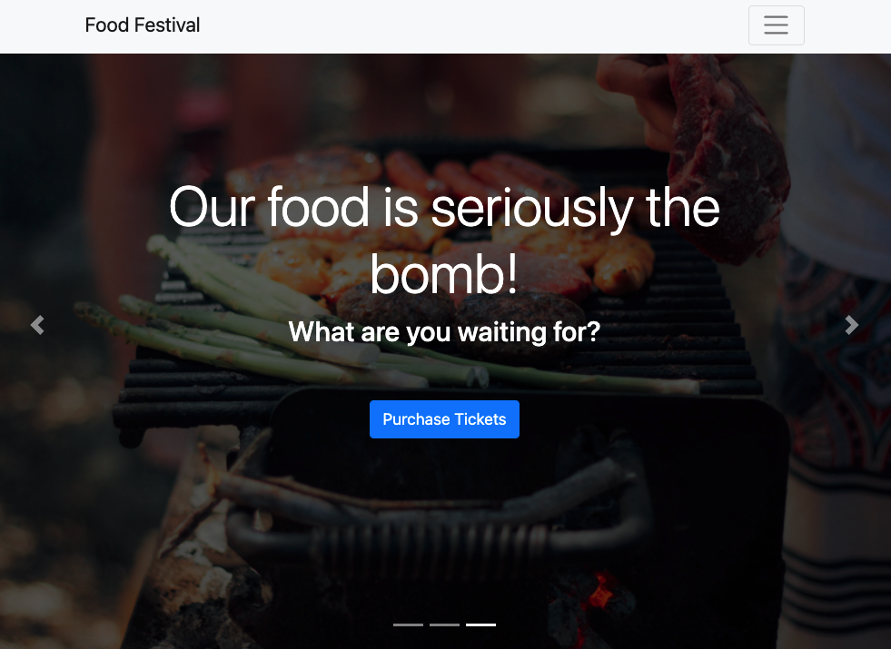

# Food Festival
Progressive Web Application for foodies!

Deployed Application: https://josh2100.github.io/food-festival/ 

## Table of Contents

- [Installation](#installation)
- [Usage](#usage)
- [License](#license)
- [Contributions](#contributions)
- [Technologies](#technologies)
- [Credits](#credits)
- [Questions](#questions)

## Installation

Clone the project. Run `npm i` in your Command Line Interface. Start your server with `node server`.

## Usage

The site features a schedule that can be viewed, a tickets screen that displays a modal, and a homepage with an image carousel. Click the icon on the right side of the URL box to download the app to your device. 

## License

This project is licensed under the MIT license.

## Contributions

Fork the project and create a pull request. Let me know how you think you can contribute!

## Technologies

Created with Node.js, webpack, bootstrap, jQuery, and popper.js. 

## Credits

Created by Joshua Schermann

## Questions

Post an issue if you find a bug or have a suggested improvement.
